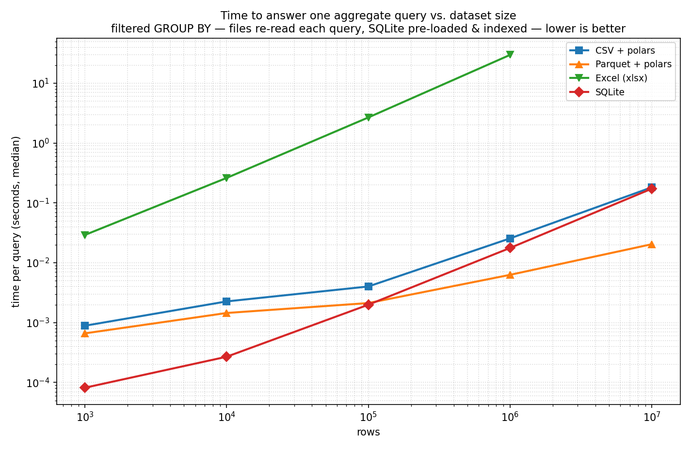

# Storage

Thanks to following the instructions in the hygiene chapter, we have now clean and tidy data.
But now, we have to figure out a place to store all this data.
All methods of data storage is not created equal.
For example, spread sheets work for certain kinds of workloads, where the data is small, and you want to make quick calculations that fit well into a table (imagine taking pencil and paper and making something similar).
CSVs are pretty close to being just text files formatted in a particular way.
For many, more complex work loads, it is way faster and often easier (and less error prone!) to use a relational database instead of a big pile of CSV files.

## The pile of CSVs (and why re-deriving in code each time hurts)

It is easy to imagine what could go wrong with a big folder of csv files, like `results.csv`, `results_2.csv`, and `merged_final.csv`.
It gets quite messy quite quickly.
Every piece of your scripts re-reads, re-filters and re-joins the data from scratch, and the "current" derivatives of the input data is whatever the last script wrote.
There is no single centralized place to browse and inspect data, and a bigger project turns messy quite quickly.
Your code base will also be messier as you re-derive same numbers in code on every run.
The better model is to store the data once, in one place and query it each time you need something in code.
This is more efficient speed-wise, less prone to errors as well as will probably require less space in storage.

You probably remember yourself browsing between a couple messy directories and wondering, "Which one was now the version of the data I am looking for?"
Even if you do not have to work that much to find the right file, it is still extra cognitive load that could be spent more productively.

## The spreadsheet trap: where data goes to silently corrupt

Spreadsheets are not a database. They are just a document. They can corrupt data in ways you will not notice, and most of your workflows will be slower to do.
Here are some possible errors that can easily happen with spreadsheets:

  - Dates: bond prices quoted in 32nds (`101-16`, meaning 101 and 16/32) and fractional quotes (`3/4`) silently become dates; two-digit years guessed wrong.
  - Leading zeros stripped: postal codes, participant IDs, phone numbers — `007` becomes `7`.
  - Locale decimal separators: `3,14` vs `3.14` flips meaning between a German and US machine; silent on open.
  - Autocorrect / autocomplete rewriting category labels.
  - Row cap: ~1,048,576 rows — data past the cap is silently dropped on import.
  - Formulas as hidden state: a cell shows a number but is really `=A2*1.2`; copy it elsewhere and it recomputes or breaks.

From the hygiene chapter we also remember, that even just looking at an Excel file might change the contents of it if you save it (out of habit).

Anything that is the raw, original data should never be stored in a spreadsheet or in Excel, as well as anything you want to process programmatically.


## File formats: CSV vs Parquet vs a database

- **CSV** — universal, human-readable, opens anywhere. But: untyped (the machine is not told if something is a number or text), no schema, no compression, slow and large at scale, ambiguous quoting/encoding. Works as an *interchange* and *raw* format; poor as a working store.
- **Parquet** — columnar, typed, compressed (smaller file sizes), fast to query selectively. Binary (not human-readable). Right choice for large tabular data you keep or share. Typed but the right choice for large tabular data you keep or share. 
- **A single-file database** — query without loading everything into memory, a schema, multiple related tables in one file. This is the working store. A copy could even be easily sent to somebody else as needed, as the database is contained in the single file!

CSV and Parquet are popular choices for sending data from one person to the other. The database should be where it lives and is processed as well as analyzed.

The difference is not academic. Below is the time to answer one realistic question — a filtered group-by aggregation — over the same data held four ways, as the row count grows. The files are re-read on every query (a pile of files has no other option); SQLite is loaded once, indexed, and then queried. Note the log scale on both axes.



The contrast that matters is Excel against everything else. At a million rows it already needs around thirty seconds to answer, and beyond its ~1.05-million-row limit it cannot open the data at all. The other three barely notice the scale: at ten million rows Parquet scanned lazily with polars answers in about twenty milliseconds, and an indexed SQLite or a CSV scan in under a fifth of a second. Operations like these might be performed multiple times in your research pipeline, so seconds matter here.


## The recommendation: SQLite, one single-file store

SQLite is a complete SQL database, but it lives in a single file (like `data/project.sqlite`), and needs no server to run. It is built into Python's standard library (no need to install any dependencies) as well as in R, Julia and Stata. It is the most widely deployed database in the world, as it's used by your phone, browser, operating system.
It fits our purposes well, because it is one self-contained file with minimal overhead setting up, but still has the features of standard SQL as well as being transactional and robust.
It is also extendable, should you wish for things that do not exist without extensions, allowing for flexibility as needed.
The big benefit is also that SQL is the standard query language used very widely in anything with databases, so it can be used with other databases than just SQLite, like DuckDB which is another great alternative with more performance optimizations.

For a researcher, one way to use an SQLite database would be to have a copy of your raw, cleaned as well as derived data there, so that your scripts write into it and query from it, and the file is part of the project (when exported) but not tracked by git (git is not meant for bigger files than code files).

## A taste

SQLite can't read a CSV in pure SQL, so you bring data in once with pandas (or the `sqlite3` CLI's `.import`), then query the store from then on. In this example we read a copy of the famous Fama-French website factor data as a raw copy, clean it to a sensible format, store both the clean and raw version so that it is ready for later analysis.

```python
import sqlite3
import pandas as pd

con = sqlite3.connect("data/project.sqlite")

# 1. land raw, as-is — here the file is already a clean rectangle, but
#    many files (e.g. the Fama-French ones) need real code to carve out first
pd.read_csv("data/raw/USREC.csv").to_sql("recession_raw", con, if_exists="replace", index=False)

# 2. derive a clean table from the raw one, once
con.execute("""
    CREATE TABLE recession AS
    SELECT substr(observation_date, 1, 7) || '-01' AS month,
           CAST(USREC AS INTEGER)                  AS recession
    FROM recession_raw
""")

# 3. from here on, just ask the store your questions
pd.read_sql("SELECT count(*) FROM recession WHERE recession = 1", con)
```

This raw-then-clean shape is exactly what the running example does across `01_load_raw.py` and `02_clean.py` — see [coding](coding.md).
